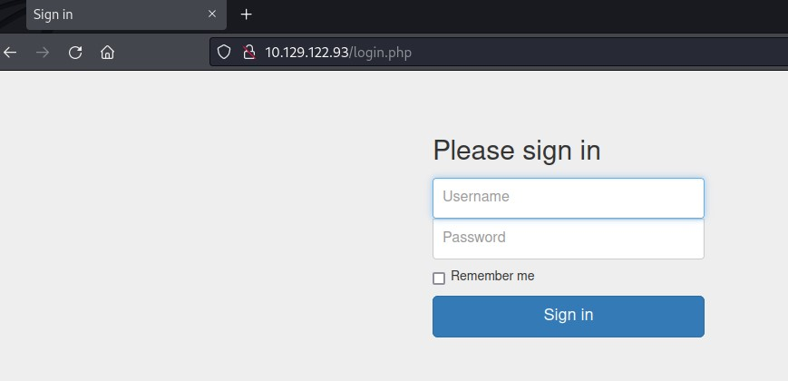

# Connection

We will connect with ftp and the user **anonymous**. There we can download two files, with users and passwords.

$ ftp 10.129.122.93

With **gobuster** we can check for others files in the webpage, and we can see a **login.php**:

$ gobuster dir -u http://10.129.122.93/ -w /usr/share/wordlists/directory-list-2.3-small.txt -x php


# Flag

We will have now this page:

With the **admin** login we can enter and get our flag.
